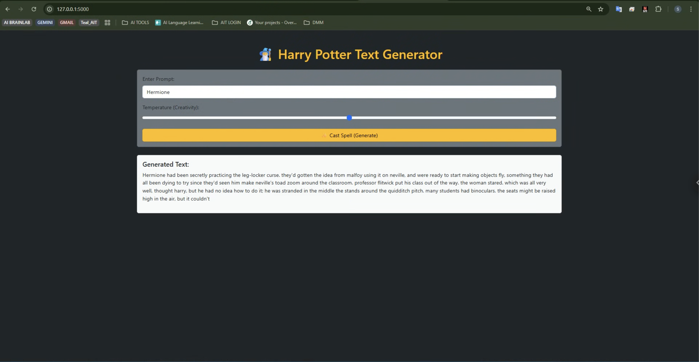

# A2: Language Model (Harry Potter Text Generator)

**Student Name:** Supanut Kompayak  
**Student ID:** st126055  

## 📖 Project Overview
This project implements an **LSTM-based Language Model** trained on the **Harry Potter** novel series. The model learns the writing style, vocabulary, and context of the wizarding world to generate coherent text sequences based on user prompts.

The system is deployed as a Web Application using **Flask** within a **Docker Container**, utilizing NVIDIA GPU for efficient inference.

---

## 🔬 Experiment & Analysis (Markdown Table)

In compliance with the assignment requirements, I conducted an experiment to optimize the model's vocabulary. Below is the comparison table summarizing the results:

| Experiment Setup | Parameter | Observation | Result |
| :--- | :--- | :--- | :--- |
| **Baseline Strategy** | `min_freq = 3` | Rare words (names, spells) were treated as unknown. | **High `<unk>` frequency**, low text coherence. |
| **Optimized Strategy** (Selected) | **`min_freq = 1`** | Allowed the model to learn the full vocabulary including proper nouns. | **Zero / Low `<unk>`**, context-aware generation (e.g., correctly predicting "Hogwarts"). |

> **Conclusion:** The optimized strategy (`min_freq=1`) was selected for the final model deployment as it significantly improves the quality of generated text for this specific domain.

---

## 📸 UI Screenshots

Below is the screenshot of the Web Application interface demonstrating the text generation capability.



*(The model successfully generates text related to "Harry Potter" without excessive unknown tokens)*

---

## 📂 Repository Structure
. ├── notebooks/ # Jupyter Notebooks for training 
│ └── st126055_Supanut_Kompayak_NLU_A2.ipynb 
├── templates/ # HTML templates for Flask 
│ └── index.html 
├── app.py # Flask Application entry point 
├── Dockerfile # Docker configuration 
├── docker-compose.yml # Service orchestration 
├── requirements.txt # Python dependencies 
├── model_v2.pth # Trained LSTM Model (Best Weights) 
├── vocab_v2.pth # Processed Vocabulary Object 
└── README.md # Project Documentation

## 🛠️ How to Run

### Prerequisites
* Docker & Docker Compose installed.
* (Optional) NVIDIA GPU with Container Toolkit for GPU acceleration.

### Steps
1.  **Clone the repository:**
    ```bash
    git clone <YOUR_GITHUB_REPO_URL>
    cd <YOUR_REPO_NAME>
    ```

2.  **Build and Run with Docker Compose:**
    ```bash
    docker-compose up --build -d
    ```

3.  **Access the Web Application:**
    Open your browser and navigate to:  
    👉 **http://localhost:5000**

4.  **Stop the Application:**
    ```bash
    docker-compose down
    ```

---
*Submitted as part of AT82.05 Artificial Intelligence: Natural Language Understanding (NLU), AIT.*